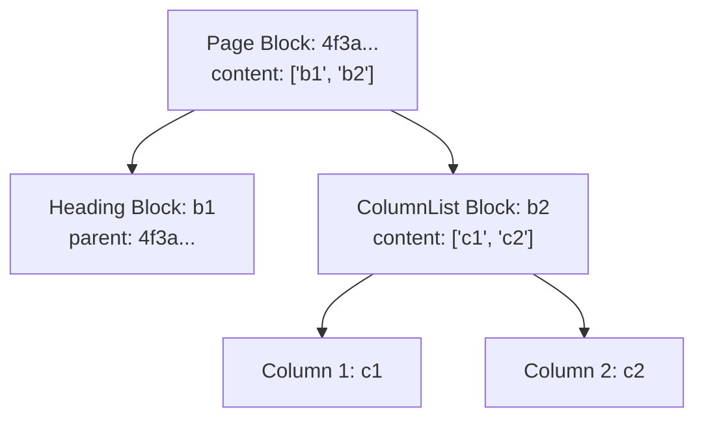

## 1. Overview

In this chapter, you will understand how Notion stores its data under the hood and why our CMS treats Notion as a headless CMS. 

By the end of this chapter, you will understand:
- Why Notion is not a traditional document or HTML string, but a graph of blocks.
- Why the official Notion API is poorly suited for full-page rendering.
- How the unofficial private Notion API produces a normalized `recordMap`.
- How the CMS fetches raw Notion data for any page ID.

---

## 2. The Problem

Most developers who want to display Notion pages inside their web app begin by reaching for Notion's official SDK (`@notionhq/client`). 

They write code that queries a page's block children, and then recursively loop through every single block to build a response.

### The Broken State: The Recursive Fetch Trap

```typescript
// ❌ NAIVE APPROACH: The Official Notion API Waterfall
import { Client } from "@notionhq/client";

const notion = new Client({ auth: process.env.NOTION_API_KEY });

async function getPageBad(blockId: string) {
  // Fetches only top-level blocks. Nested blocks (toggles, columns) are NOT included!
  const response = await notion.blocks.children.list({ block_id: blockId });
  
  for (const block of response.results) {
    if (block.has_children) {
      // ⚠️ Triggers N+1 sequential network requests!
      // A page with 50 blocks can take 15 to 30 seconds to load!
      block.children = await getPageBad(block.id);
    }
  }
  return response;
}
```

When you run this in production, three catastrophic problems appear:
1. **The N+1 Latency Nightmare**: Loading a page with nested toggles or column layouts takes 20+ sequential network requests. Page loads take 10+ seconds.
2. **Missing Layout Metadata**: The official API strips out critical styling data like column widths, callout icons, color schemes, and custom block formatting.
3. **Severe Rate Limiting**: Sending 30 queries per page triggers Notion's `429 Too Many Requests` almost instantly.

### The Root Cause

> **So the root cause is:**
> The official Notion API exposes an un-computed, hierarchical block tree designed for low-volume CRUD operations. It does not provide the unified, pre-computed document snapshot that the Notion desktop and web apps use to render pages in a single roundtrip.

### So How Can We Solve This?

Instead of hammering the server with dozens of recursive calls, what if we could ask Notion for the exact same pre-computed document dictionary that `notion.so` downloads when you open a note in your browser?

---

## 3. Core Concept & Architecture

### What is a `recordMap`?

Think of a Notion document like a flat box of Lego bricks. Each brick has an ID stamped on it. Instead of nesting bricks inside bricks, Notion stores all bricks side-by-side in a dictionary called the **`recordMap`**. 

Every block points to its children using an array of ID pointers:



In JSON, this flat dictionary looks like this:

```json
{
  "block": {
    "page-id-123": {
      "value": {
        "id": "page-id-123",
        "type": "page",
        "content": ["heading-id-456", "text-id-789"]
      }
    },
    "heading-id-456": {
      "value": {
        "id": "heading-id-456",
        "type": "header",
        "properties": { "title": [["Welcome to the Course"]] }
      }
    }
  }
}
```

### First-Principles Chain of Thought

1. **Why not just export Notion notes as Markdown?**
   Markdown is great for basic text, but it completely discards rich Notion features: multi-column side-by-side layouts, toggles, bookmark previews, synched blocks, and database views.

2. **Why not just use an `<iframe>`?**
   An iframe forces Notion's entire heavy web application onto your user. It prevents custom typography, breaks dark-mode synchronization, and ruins SEO because search engines cannot index the iframe content.

3. **How does `notion-client` obtain the `recordMap`?**
   `notion-client` sends an HTTP POST request to Notion's internal API endpoint: `https://www.notion.so/api/v3/loadPageChunk`. Notion returns the full `recordMap` in a single network roundtrip!

### As a human, what questions should I ask to learn this?
- *"How does Notion represent text formatting like bold and links?"* (Answer: It stores arrays of tuples, e.g., `[["Click here", [["a", "https://google.com"]]]]`).
- *"Why are block IDs formatted both with and without dashes?"* (Answer: Notion accepts both UUID formats, e.g., `12345678-1234-1234-1234-123456789abc` and `12345678123412341234123456789abc`).

---

## 4. Code & Implementation

Here is how our backend initializes the Notion client using `notion-client` to fetch a full page `recordMap` in a single call.

```typescript
// backend/src/lib/notion.ts
import { NotionAPI } from "notion-client";
import "dotenv/config";

// Decode the Notion token if URL-encoded
const rawToken = process.env.NOTION_TOKEN_V2 ?? "";
const authToken = rawToken.includes("%") ? decodeURIComponent(rawToken) : rawToken;

// Initialize the private Notion API client
export const notion = new NotionAPI({
  authToken,
  ofetchOptions: {
    headers: {
      "User-Agent":
        "Mozilla/5.0 (Macintosh; Intel Mac OS X 10_15_7) AppleWebKit/537.36 (KHTML, like Gecko) Chrome/122.0.0.0 Safari/537.36",
    },
  },
});

// Fetch full recordMap in a single roundtrip
export async function fetchRawRecordMap(pageId: string) {
  // getPage hits Notion's loadPageChunk endpoint
  const recordMap = await notion.getPage(pageId);
  return recordMap;
}
```

### How to test this directly:

```typescript
// Quick sanity test
const data = await fetchRawRecordMap("YOUR_NOTION_PAGE_ID");
console.log("Total blocks fetched in 1 call:", Object.keys(data.block).length);
```

---

## 5. Key Gotchas

- **Private Pages Require `NOTION_TOKEN_V2`**: If your Notion page is not publicly published to the web, `notion.getPage(pageId)` will throw a `403 Forbidden` unless you provide the `token_v2` cookie from your logged-in browser session.
- **Malformed Block IDs**: Notion URLs often contain titles and query strings (e.g. `https://notion.so/My-Page-3a2b1c4d...`). You must extract the clean 32-character hexadecimal string before passing it to `notion.getPage()`.
- **Empty Blocks Object**: If a page is locked or archived, Notion may return a 200 OK with an empty `{ block: {} }` map. Always verify `Object.keys(recordMap.block).length > 0`.

---

## 6. Summary Checklist

- [ ] Notion stores documents as a normalized dictionary called a `recordMap`, not a nested tree.
- [ ] The official API causes N+1 request waterfalls, whereas `notion-client` gets all blocks in 1 call.
- [ ] Each block stores its text as structured tuples and points to child IDs via a `content` array.
- [ ] Set `NOTION_TOKEN_V2` in your `.env` to read private pages and prevent 403 authorization failures.
