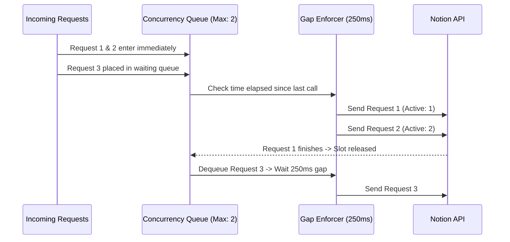

## 1. Overview

In this chapter, you will learn how our backend manages traffic to Notion's servers without getting blocked, rate-limited, or banned.

By the end of this chapter, you will understand:
- Why unthrottled requests to Notion trigger HTTP `429 Too Many Requests` or connection drops.
- How to build a lightweight Semaphore to cap concurrent requests to Notion.
- How to enforce an artificial spacing gap (`MIN_GAP_MS`) between outbound requests.
- Why exponential backoff is essential, and when you must deliberately bypass retries.

---

## 2. The Problem

Imagine a user lands on a course syllabus page, or an admin triggers a full course sync. The server tries to fetch 10 chapters at once using `Promise.all()`.

### The Broken State: Uncontrolled Parallel Bursts

```typescript
// ❌ NAIVE APPROACH: The Burst Flood
async function syncAllChaptersBad(pageIds: string[]) {
  // Fires 10-20 requests simultaneously to Notion's servers!
  const results = await Promise.all(
    pageIds.map((id) => notion.getPage(id))
  );
  return results;
}
```

```text
HTTP 429 Too Many Requests
FetchError: request to https://www.notion.so/api/v3/loadPageChunk failed, 
reason: Client network socket disconnected before secure TLS connection was established
```

When this runs under traffic, two things break:
1. **Aggressive Notion Throttling**: Notion returns `429 Too Many Requests` or terminates the TLS handshake outright.
2. **Cascading Downtime**: Every subsequent visitor gets a blank page because Notion temporarily blacklists your server's IP address.

### The Root Cause

> **So the root cause is:**
> Notion's internal API is engineered for interactive human browser traffic, not automated batch scrapers. Burst requests without concurrency limits trigger Notion's DDoS and rate-limiting defenses.

### So How Can We Solve This?

We must regulate outbound traffic with a **Traffic Controller**:
1. Limit simultaneous active requests to a safe threshold (e.g. `MAX_CONCURRENCY = 2`).
2. Enforce a minimum quiet gap between consecutive calls (`MIN_GAP_MS = 250`).
3. Retry transient errors using exponential backoff while immediately aborting fatal errors (like `403` or `404`).

---

## 3. Core Concept & Architecture

### The Concurrency Semaphore and Leaky-Bucket Gap

Think of Notion's API like a 2-lane bridge with a toll booth. No matter how many cars arrive, only 2 cars can be on the bridge at the exact same moment. Furthermore, cars must wait at least 250ms after the previous car enters.



### First-Principles Chain of Thought

1. **Why not set concurrency to 10?**
   Notion's undocumented endpoints will close your TCP socket if you open more than 2-3 concurrent calls from the same IP with the same `token_v2`.

2. **Why use exponential backoff instead of a fixed 1-second delay?**
   If Notion's servers are under heavy load, retrying every 1 second keeps their servers overloaded. Doubling the wait time (300ms → 600ms → 1200ms → 2400ms) allows upstream servers time to recover.

3. **Why MUST we skip retries on HTTP 403 or 404?**
   If a page is deleted (404) or permission is denied (403), waiting and retrying 4 times will NEVER fix the error. It only wastes 5+ seconds making your user stare at a spinning loader.

### As a human, what questions should I ask to learn this?
- *"What is the difference between a mutex and a semaphore?"* (A mutex allows 1 holder; a semaphore allows `N` holders).
- *"What happens to queued promises if the server crashes?"* (In-memory queues exist only during runtime; failed requests reject safely).

---

## 4. Code & Implementation

Here is our production `notionThrottle.ts` implementation:

```typescript
// backend/src/service/notionThrottle.ts
import { NotionAPI } from "notion-client";

const MAX_CONCURRENCY = 2;
const MIN_GAP_MS = 250;
const MAX_RETRIES = 4;

let activeCount = 0;
let lastRequestTime = 0;
const queue: Array<{ resolve: () => void }> = [];

// Semaphore: Request a slot before fetching
async function acquireSlot(): Promise<void> {
  if (activeCount < MAX_CONCURRENCY) {
    activeCount++;
    return;
  }
  return new Promise<void>((resolve) => {
    queue.push({ resolve: () => { activeCount++; resolve(); } });
  });
}

// Semaphore: Release slot so next queued caller can proceed
function releaseSlot() {
  activeCount--;
  if (queue.length > 0) {
    const next = queue.shift()!;
    next.resolve();
  }
}

const sleep = (ms: number) => new Promise((resolve) => setTimeout(resolve, ms));

function isFatalError(err: any): boolean {
  return err?.status === 403 || err?.statusCode === 403 ||
         err?.status === 404 || err?.statusCode === 404;
}

// Main throttled fetcher with exponential backoff
export async function fetchWithRetry(notion: NotionAPI, pageId: string): Promise<any> {
  await acquireSlot();
  try {
    // 1. Enforce minimum time gap between calls
    const elapsed = Date.now() - lastRequestTime;
    if (elapsed < MIN_GAP_MS) {
      await sleep(MIN_GAP_MS - elapsed);
    }

    // 2. Retry loop with exponential backoff
    for (let attempt = 0; attempt < MAX_RETRIES; attempt++) {
      try {
        lastRequestTime = Date.now();
        return await notion.getPage(pageId);
      } catch (err: any) {
        // Fast-fail: Never retry permission or not-found errors
        if (isFatalError(err) || attempt === MAX_RETRIES - 1) {
          throw err;
        }
        const delay = 300 * Math.pow(2, attempt);
        console.warn(`[Throttle] Retrying ${pageId} in ${delay}ms...`);
        await sleep(delay);
      }
    }
  } finally {
    // 3. Always release the slot, even if errors occur!
    releaseSlot();
  }
}
```

---

## 5. Key Gotchas

- **Deadlocking the Semaphore**: If you don't release the slot inside a `finally` block, an uncaught error will permanently leak a slot. Once 2 requests leak, your entire server freezes and never answers another request!
- **Clock Drift with `Date.now()`**: If system time shifts backward during an NTP sync, `elapsed` could be negative. Always use `Math.max(0, MIN_GAP_MS - elapsed)`.
- **403 Disguised in Error Messages**: Notion sometimes returns generic 500 errors or text strings containing `"403"` when cookies expire. Always inspect `err.message` as well as `err.status`.

---

## 6. Summary Checklist

- [ ] Cap Notion concurrency to 2 simultaneous active requests using a lightweight in-memory queue.
- [ ] Maintain at least a 250ms quiet window between outbound requests to avoid burst rate-limiting.
- [ ] Back off exponentially (`300ms * 2^attempt`) on network timeouts and 429 responses.
- [ ] Fail fast immediately on 403 Forbidden and 404 Not Found to prevent useless retries.
- [ ] Always release semaphore slots inside `finally` blocks to prevent queue deadlocks.
