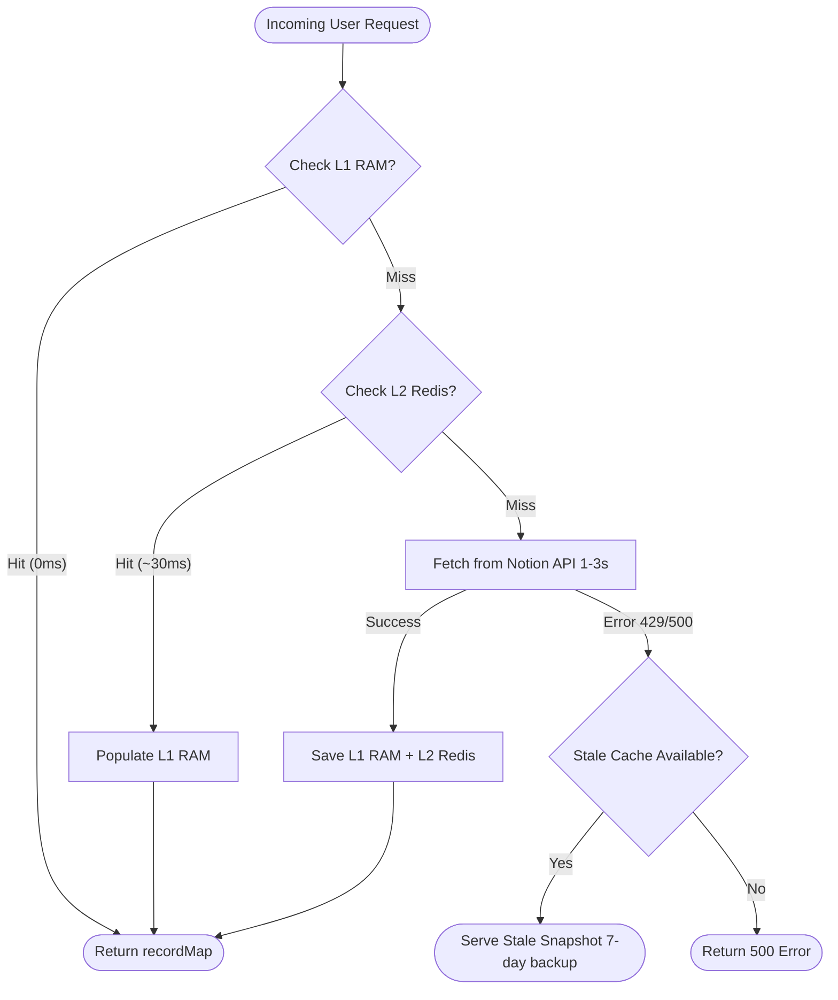

## 1. Overview

In this chapter, you will learn how the CMS achieves sub-millisecond response times using a multi-tiered caching architecture.

By the end of this chapter, you will understand:
- Why direct requests to Notion make web applications unacceptably sluggish (2–4 seconds per click).
- How the two-level caching hierarchy works (L1 In-Memory RAM + L2 Distributed Redis).
- How the dual-key strategy (`fresh` vs `stale`) keeps your website 100% online even during Notion service outages.
- How to invalidate caches when notes change.

---

## 2. The Problem

Without caching, every single user click sends a synchronous HTTPS request to Notion's servers in the background.

### The Broken State: Direct Uncached Reads

```typescript
// ❌ NAIVE APPROACH: Direct Origin Fetching
app.get("/api/notes/:pageId", async (req, res) => {
  const { pageId } = req.params;
  
  // 🐢 Latency: 2,400ms - 4,000ms on every single page load!
  // 💥 If Notion has a 10-second outage, your whole website crashes with 500s!
  const recordMap = await notion.getPage(pageId);
  return res.json({ recordMap });
});
```

This architecture breaks in three fatal ways:
1. **Unacceptable Latency**: Users wait 2 to 4 seconds just to read a chapter.
2. **Server Burnout**: If 50 students read notes simultaneously, your server exhausts its connection pool.
3. **Zero Fault Tolerance**: When Notion's API experiences downtime, your entire platform goes dark.

### The Root Cause

> **So the root cause is:**
> Remote third-party APIs have high network latency and unpredictable availability. Relying on an external origin for real-time reads turns third-party downtime into your downtime.

### So How Can We Solve This?

We implement a **3-Tier Fallback Hierarchy**:
- **Tier 1 (L1 Memory)**: Process RAM (0ms latency, ephemeral).
- **Tier 2 (L2 Redis)**: Serverless Upstash Redis (~30ms latency, persistent across server restarts).
- **Tier 3 (Origin API)**: Notion API (1-3s, re-populates both L1 and L2).
- **Stale Fallback**: If Tier 3 fails, serve a 7-day stale backup so the user never sees an error.

---

## 3. Core Concept & Architecture

### The Multi-Tier Flow Diagram



### First-Principles Chain of Thought

1. **Why do we need L1 RAM if we already have Redis?**
   Redis is fast (~30ms), but it still requires a network socket call over TCP. An in-memory JavaScript `Map` takes **0.05ms** (CPU memory access). Serving 95% of hits from L1 RAM gives users an instantaneous desktop-app feel.

2. **Why do we need Redis if L1 RAM is so fast?**
   When your Node.js server redeploys or restarts, RAM is instantly wiped. Without Redis, the first visitors after a deploy would slam Notion's servers simultaneously (Cache Stampede). Redis survives restarts and is shared across all load-balanced server instances.

3. **What is the purpose of the `stale` key?**
   A standard key (`notion:page:${id}`) expires after 30 minutes. But we also write a twin key (`notion:stale:${id}`) with a 7-day TTL. If Notion is down tomorrow, we gracefully serve yesterday's snapshot instead of a blank 500 error screen.

### As a human, what questions should I ask to learn this?
- *"How much memory does a typical Notion recordMap take?"* (Typically 50KB to 400KB in JSON format).
- *"How do we prevent memory leaks in L1 RAM?"* (By checking timestamps or setting a maximum cache size).

---

## 4. Code & Implementation

Here is our production tiered caching engine from `notionCache.ts`:

```typescript
// backend/src/service/notionCache.ts
import { NotionAPI } from "notion-client";
import { Redis } from "@upstash/redis";
import { fetchWithRetry } from "./notionThrottle.js";

const CACHE_TTL_SECONDS = 30 * 60; // 30 minutes fresh
const CACHE_TTL_MS = CACHE_TTL_SECONDS * 1000;

// L1 In-Memory RAM Store (0ms)
const memoryFreshCache = new Map<string, { recordMap: any; ts: number }>();
const memoryStaleCache = new Map<string, any>();

// L2 Distributed Redis Store (~30ms)
const redis = process.env.UPSTASH_REDIS_REST_URL
  ? new Redis({
      url: process.env.UPSTASH_REDIS_REST_URL,
      token: process.env.UPSTASH_REDIS_REST_TOKEN,
    })
  : null;

export async function getCachedNotionPage(notion: NotionAPI, pageId: string): Promise<any> {
  const freshKey = `notion:page:${pageId}`;
  const staleKey = `notion:stale:${pageId}`;

  // 1. Tier 1: Check L1 Local RAM (Instant 0ms)
  const local = memoryFreshCache.get(pageId);
  if (local && Date.now() - local.ts < CACHE_TTL_MS) {
    return local.recordMap;
  }

  // 2. Tier 2: Check L2 Upstash Redis
  if (redis) {
    const redisCached = await redis.get<any>(freshKey);
    if (redisCached) {
      // Re-populate L1 RAM for future instant lookups
      memoryFreshCache.set(pageId, { recordMap: redisCached, ts: Date.now() });
      memoryStaleCache.set(pageId, redisCached);
      return redisCached;
    }
  }

  // 3. Tier 3: Fetch from Notion API with throttling
  try {
    const recordMap = await fetchWithRetry(notion, pageId);

    if (recordMap && Object.keys(recordMap.block || {}).length > 0) {
      // Save to L1 RAM
      memoryFreshCache.set(pageId, { recordMap, ts: Date.now() });
      memoryStaleCache.set(pageId, recordMap);

      // Save to L2 Redis (Fresh: 30 mins, Stale: 7 days)
      if (redis) {
        redis.set(freshKey, recordMap, { ex: CACHE_TTL_SECONDS }).catch(console.warn);
        redis.set(staleKey, recordMap, { ex: 7 * 24 * 3600 }).catch(console.warn);
      }
    }
    return recordMap;
  } catch (err) {
    console.error(`[Cache] Origin fetch failed for ${pageId}. Checking stale backup...`);

    // Fault-tolerant fallback: Serve stale L1 or L2
    if (memoryStaleCache.has(pageId)) return memoryStaleCache.get(pageId);
    if (redis) {
      const staleData = await redis.get<any>(staleKey);
      if (staleData) return staleData;
    }
    throw err;
  }
}

// Invalidate on demand (e.g. when an admin edits notes)
export async function invalidatePageCache(pageId: string) {
  memoryFreshCache.delete(pageId);
  memoryStaleCache.delete(pageId);
  if (redis) {
    await redis.del(`notion:page:${pageId}`, `notion:stale:${pageId}`);
  }
}
```

---

## 5. Key Gotchas

- **Redis Payload Size Limits**: Free serverless Redis tiers (like Upstash Free) have a 1MB payload limit per key. Extraordinarily large Notion pages (e.g., 5,000 blocks with embedded base64 images) will fail to set in Redis. Always link external images rather than pasting raw base64.
- **Cache Invalidation Amnesia**: When an author edits a Notion page, neither L1 RAM nor Redis knows until the 30-minute TTL expires unless you expose an on-demand invalidation webhook or admin button (`invalidatePageCache`).
- **Fire-and-Forget Promises**: Notice how `redis.set(...).catch(console.warn)` runs asynchronously without `await`. Do not make your user wait for the Redis write operation when you already have the data in hand to return immediately.

---

## 6. Summary Checklist

- [ ] L1 Memory provides instant 0ms responses; L2 Redis persists data across server restarts.
- [ ] Fresh cache keys expire in 30 minutes; stale backup keys persist for 7 days.
- [ ] If Notion throws 429 or 500 errors, the engine seamlessly serves the stale backup.
- [ ] Writes to Redis are non-blocking fire-and-forget calls to minimize user response latency.
