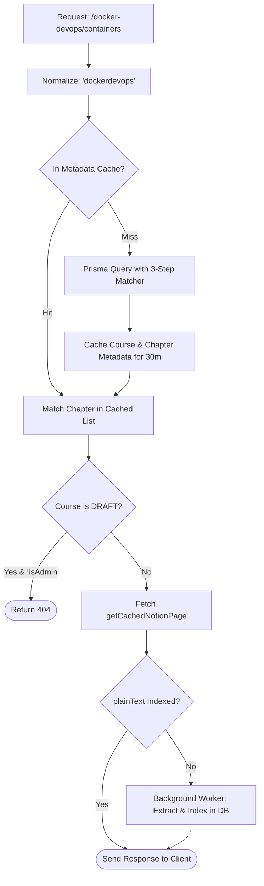

## 1. Overview

In this chapter, you will learn how the CMS maps human-readable browser URLs like `/system-design/caching` to internal Notion page IDs, controls draft visibility, and indexes raw Notion blocks for instant search.

By the end of this chapter, you will understand:
- How our multi-strategy slug matching resolves course and chapter routes without 404 bugs.
- Why we cache course metadata separately from Notion `recordMap` data.
- How background plain-text extraction indexes Notion block content into PostgreSQL without slowing down user page loads.
- How admin authorization guards draft notes.

---

## 2. The Problem

Notion identifies pages with 32-character hexadecimal UUIDs like `4f3a28b1-9c02-4d5e-8812-78d8a1c9e312`. But your website visitors expect clean, SEO-friendly URLs like:
`/fullstack-course/intro-to-apis`

### The Broken State: Fragile String Matching

```typescript
// ❌ NAIVE APPROACH: Exact String Queries
app.get("/notes/:subject/:chapter", async (req, res) => {
  const { subject, chapter } = req.params;

  // ⚠️ Breaks on:
  // - "fullstack-course" vs "Fullstack Course"
  // - Slashes, special characters, or spaces
  // - Users pasting a raw Notion UUID directly into the address bar
  const course = await prisma.course.findUnique({
    where: { title: subject }
  });
  
  if (!course) return res.status(404).json({ error: "Not found" });
  // ...
});
```

This naive approach breaks in three common scenarios:
1. **Broken Links from Minor Typo/Casing Differences**: A user following `/Docker/01-Containers` gets a 404 error if the database title is `"docker"`.
2. **Slow Database Hits on Every Click**: Querying the relational database for courses and chapter orders on every page view adds unnecessary latency.
3. **No Searchable Content**: Because Notion content lives outside PostgreSQL, full-text SQL searches (`to_tsvector`) cannot find chapters by text content.

### The Root Cause

> **So the root cause is:**
> Human URLs are flexible, variable, and casing-independent, while database queries are strict. Furthermore, raw Notion blocks are nested JSON objects that cannot be queried with standard SQL search indexes.

### So How Can We Solve This?

We implement:
1. **A 3-Step Resilient Slug Matcher** (exact match → normalized alphanumeric match → raw UUID reverse lookup).
2. **Course Metadata Caching** (`cms:course_meta:...`).
3. **Non-blocking Plain Text Extraction** to populate PostgreSQL search columns in the background.

---

## 3. Core Concept & Architecture

### The Request Lifecycle



### First-Principles Chain of Thought

1. **Why normalize strings by stripping non-alphanumeric characters?**
   Users, browsers, and Notion export filenames treat punctuation differently (e.g. `c++-basics`, `c-basics`, `C++ Basics`). By comparing `text.toLowerCase().replace(/[^a-z0-9]/g, "")`, all variations cleanly map to the same entity.

2. **Why extract plain text in the background?**
   Extracting text from 500 Notion blocks takes 15–30ms of CPU time. If we `await` that operation before sending the HTTP response, the visitor waits longer. By letting the extraction run asynchronously without `await`, the visitor receives their notes instantly while the database indexes itself in the background.

3. **What did we use before this?**
   Before background extraction, developers had to run manual cron jobs or complex webhook servers to re-index documents whenever Notion content changed.

### As a human, what questions should I ask to learn this?
- *"What happens if two courses have names that normalize to the same string?"* (Exact case-insensitive matches run first, giving priority to exact titles).
- *"How do we extract text from rich Notion text objects?"* (Notion text is stored as an array of character chunks with inline styling tags).

---

## 4. Code & Implementation

Here is how `fetchNotecontent.ts` resolves URLs and extracts plain text:

```typescript
// backend/src/service/fetchNotecontent.ts
import { prisma } from "../../lib/Prisma.js";
import { getCachedNotionPage, getHybridCache, setHybridCache } from "./notionCache.js";
import { extractNotionPlainText } from "./textExtractor.js";

const normalize = (s: string) => s.toLowerCase().replace(/[^a-z0-9]/g, "");

export async function fetchNotesContent(subjectName: string, chapterName?: string, isAdmin = false) {
  const targetSlug = normalize(subjectName);
  const cacheKey = `cms:course_meta:${targetSlug}`;

  // 1. Check Course Metadata Cache
  let meta = await getHybridCache<{ course: any; chapters: any[] }>(cacheKey);

  if (!meta) {
    // Strategy A: Exact or space-replaced match
    let course = await prisma.course.findFirst({
      where: {
        OR: [
          { title: { equals: subjectName, mode: "insensitive" } },
          { title: { equals: subjectName.replaceAll("-", " "), mode: "insensitive" } }
        ]
      }
    });

    // Strategy B: Match across normalized slugs
    if (!course) {
      const all = await prisma.course.findMany();
      course = all.find((c) => normalize(c.title) === targetSlug) || null;
    }

    if (!course) return null;

    const chapters = await prisma.chapter.findMany({
      where: { courseId: course.id },
      orderBy: { order: "asc" }
    });

    meta = { course, chapters };
    await setHybridCache(cacheKey, meta, 1800); // 30 min cache
  }

  // 2. Draft Security Check
  if (meta.course.status === "DRAFT" && !isAdmin) {
    return null;
  }

  // 3. Resolve Target Chapter
  const targetChapter = chapterName
    ? meta.chapters.find((ch) => normalize(ch.chapterName) === normalize(chapterName))
    : meta.chapters[0];

  if (!targetChapter || !targetChapter.pageId) return null;

  // 4. Fetch Notion recordMap via tiered cache
  const recordMap = await getCachedNotionPage(notion, targetChapter.pageId);

  // 5. Non-blocking Background Search Indexing
  if (recordMap && !targetChapter.plainText) {
    const { plainText, snippet } = extractNotionPlainText(recordMap);
    if (plainText) {
      prisma.chapter.update({
        where: { id: targetChapter.id },
        data: { plainText, contentSnippet: snippet }
      }).catch(console.warn); // Non-blocking!
    }
  }

  return { contentType: "NOTION", recordMap, chaptersData: meta.chapters };
}
```

### Text Extraction Helper

```typescript
// backend/src/service/textExtractor.ts
export function extractNotionPlainText(recordMap: any) {
  const textPieces: string[] = [];
  
  for (const blockId of Object.keys(recordMap?.block || {})) {
    const block = recordMap.block[blockId]?.value;
    if (block?.properties?.title) {
      const titleChunks = block.properties.title;
      // Notion title property is an array of text chunks: [["Hello", [["b"]]]]
      const text = titleChunks.map((c: any) => (Array.isArray(c) ? c[0] : c)).join("");
      textPieces.push(text);
    }
  }

  const plainText = textPieces.join(" \n ").trim();
  const snippet = plainText.slice(0, 250);
  return { plainText, snippet };
}
```

---

## 5. Key Gotchas

- **Blocking on Prisma Updates**: Never `await` the background text indexing in the critical request path. Doing so increases response latency for no reason.
- **Cache Stale Metadata on Chapter Re-order**: If an author changes chapter order in the admin portal, invalidate the `cms:course_meta:${targetSlug}` key immediately, otherwise the navigation bar will show outdated chapter lists.
- **Handling First-Chapter Fallbacks**: When users visit `/system-design` without specifying a chapter, always gracefully default to `meta.chapters[0]`.

---

## 6. Summary Checklist

- [ ] Normalize slugs with `replace(/[^a-z0-9]/g, "")` to handle spaces, dashes, and case variations.
- [ ] Cache course & chapter database metadata for 30 minutes to reduce database queries.
- [ ] Hide `DRAFT` status courses unless the user has admin privileges.
- [ ] Run plain-text extraction asynchronously to keep response times under 50ms while indexing search data.
