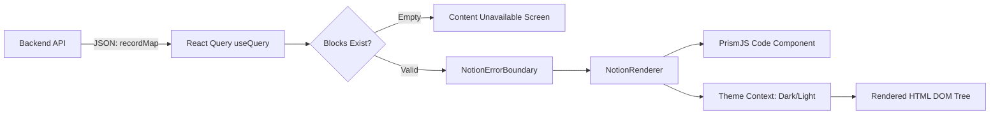

## 1. Overview

In this chapter, you will learn how the client-side React application transforms the raw `recordMap` JSON dictionary into a pixel-perfect, interactive documentation page.

By the end of this chapter, you will understand:
- How `react-notion-x` renders complex block structures (callouts, multi-column layouts, toggles).
- How to configure syntax highlighting for code blocks using PrismJS.
- How to integrate dark and light theme switching.
- Why wrapping renderers in an Error Boundary is mandatory for third-party document rendering.

---

## 2. The Problem

When developers first receive a `recordMap` from their backend, they often attempt to hand-roll custom React components to render the blocks.

### The Broken State: The Infinite Switch Statement

```tsx
// ❌ NAIVE APPROACH: Hand-rolled Block Mapping
function RenderBlockBad({ block }: { block: any }) {
  // ⚠️ Writing custom components for 40+ block types is fragile:
  switch (block.type) {
    case "text":
      return <p>{block.properties?.title?.[0]?.[0]}</p>;
    case "header":
      return <h1>{block.properties?.title?.[0]?.[0]}</h1>;
    // 💥 What about columns? Toggles? KaTeX math? Code syntax highlighting?
    // Nested children lose their layout and crash with 'Cannot read properties of undefined'!
    default:
      return <div>Unsupported block: {block.type}</div>;
  }
}
```

This breaks in production because:
1. **Layout Chaos**: Notion's multi-column grids, toggles, callout boxes, and synced blocks require hundreds of lines of complex recursive CSS.
2. **White Screen of Death**: If an author uses an exotic or deprecated block type, an unhandled JavaScript error crashes the entire React application.
3. **No Code Highlighting**: Code blocks appear as unformatted monospace text without line numbers or syntax coloring.

### The Root Cause

> **So the root cause is:**
> Notion is not simple HTML. It is a structured graph of specialized block widgets. Hand-rolling block renderers is prone to layout bugs and crashes on edge cases.

### So How Can We Solve This?

We use `react-notion-x`, the battle-tested React engine that renders Notion's `recordMap` natively, and enhance it with PrismJS code highlighting and React Error Boundaries.

---

## 3. Core Concept & Architecture

### The Rendering Pipeline



### First-Principles Chain of Thought

1. **Why is the `Code` component imported separately in `react-notion-x`?**
   PrismJS syntax highlighting bundles hundreds of programming languages, which can add over 200KB to the JavaScript bundle. By making it modular (`react-notion-x/build/third-party/code`), projects only load syntax highlighting if they explicitly need it.

2. **Why do we need an Error Boundary around the renderer?**
   Even though `react-notion-x` is reliable, Notion's private API occasionally introduces new experimental block schemas. An Error Boundary catches render-time errors inside Notion blocks so the rest of your app (navbar, sidebar, header) remains fully functional.

3. **How does dark mode work?**
   `react-notion-x` ships with both light and dark CSS classes. Passing `darkMode={isDark}` automatically toggles high-contrast styles, inverted typography, and dark PrismJS color schemes.

### As a human, what questions should I ask to learn this?
- *"What CSS files do I need to import for Notion styles to display properly?"* (You must import `react-notion-x/src/styles.css` and a PrismJS theme stylesheet).
- *"How do I disable Notion's default full-page header so my own navbar works?"* (Set `disableHeader={true}`).

---

## 4. Code & Implementation

Here is our production rendering implementation from `Noteui.tsx`:

```tsx
// frontend/src/pages/note/Noteui.tsx
import { useContext } from "react";
import { useParams } from "react-router";
import { useQuery } from "@tanstack/react-query";
import { NotionRenderer } from "react-notion-x";
import { Code } from "react-notion-x/build/third-party/code";
import { theme } from "../../theme";
import NotionErrorBoundary from "../Components/NotionErrorBoundary";
import { getNotes } from "../../service/centralisedApi";

// Required stylesheets for Notion layout and syntax highlighting
import "react-notion-x/src/styles.css";
import "prismjs/themes/prism-tomorrow.css";
import "./Noteui.css";

export default function Noteui() {
  const { subject_name, chapter_name } = useParams();
  const themeContext = useContext(theme);
  const isDark = themeContext?.currentTheme === "dark";

  // 1. Fetch note data using React Query
  const { data, isLoading, isError } = useQuery({
    queryKey: ["notes", subject_name, chapter_name],
    queryFn: () => getNotes(subject_name || "", chapter_name),
    staleTime: 5 * 60 * 1000,
    refetchOnWindowFocus: false,
  });

  if (isLoading) {
    return <div className="noteui-loading">Loading documentation…</div>;
  }

  if (isError || !data?.recordMap?.block || Object.keys(data.recordMap.block).length === 0) {
    return (
      <div className="empty-state">
        <h3>Content Unavailable</h3>
        <p>This chapter is currently empty or temporarily unavailable.</p>
      </div>
    );
  }

  // 2. Render Notion RecordMap inside Error Boundary
  return (
    <div className={`noteui-wrapper ${isDark ? "" : "notion-light-mode"}`}>
      <NotionErrorBoundary>
        <NotionRenderer
          recordMap={data.recordMap}
          fullPage={true}
          darkMode={isDark}
          disableHeader={true}
          components={{
            Code, // Custom PrismJS syntax highlighter
          }}
        />
      </NotionErrorBoundary>
    </div>
  );
}
```

### The Error Boundary Component

```tsx
// frontend/src/pages/Components/NotionErrorBoundary.tsx
import React, { Component, ErrorInfo, ReactNode } from "react";

interface Props {
  children: ReactNode;
}
interface State {
  hasError: boolean;
}

export default class NotionErrorBoundary extends Component<Props, State> {
  state: State = { hasError: false };

  static getDerivedStateFromError(): State {
    return { hasError: true };
  }

  componentDidCatch(error: Error, errorInfo: ErrorInfo) {
    console.error("Notion render failed:", error, errorInfo);
  }

  render() {
    if (this.state.hasError) {
      return (
        <div className="p-8 text-center text-red-500">
          Failed to render this document. Please reload or contact support.
        </div>
      );
    }
    return this.props.children;
  }
}
```

---

## 5. Key Gotchas

- **Forgetting the CSS Import**: If you forget `import 'react-notion-x/src/styles.css';`, the page renders as an unstyled stack of raw text without columns or margins.
- **Component Replacement Props**: Custom component overrides must be passed inside the `components={{ ... }}` prop. Passing them as direct props will be ignored.
- **Empty Block Guard**: Always check `Object.keys(data.recordMap.block).length === 0` before rendering to avoid runtime crashes on empty or archived Notion pages.

---

## 6. Summary Checklist

- [ ] Use `react-notion-x` to render normalized `recordMap` dictionaries into native HTML.
- [ ] Import `react-notion-x/src/styles.css` and PrismJS theme CSS for proper styling.
- [ ] Modularize syntax highlighting by passing `Code` into `components={{ Code }}`.
- [ ] Wrap all Notion render trees in a `NotionErrorBoundary` to prevent app-wide white screens.
